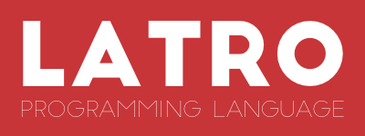

:Author: James Swaine <james.swaine@gmail.com>

.. image:: https://travis-ci.org/Zoetermeer/latro.svg?branch=master
    :target: https://travis-ci.org/Zoetermeer/latro

.. image:: https://img.shields.io/github/license/mashape/apistatus.svg?maxAge=2592000   :target: 

Latro is a statically-typed, general-purpose functional programming language designed
to make people more productive.  It does not attempt to include every
esoteric language feature, or bury you in cryptic discourse on
bleeding-edge type theory.  The goal is to blend some of the core
ideas of functional programming into a clear, concise syntax that
will appear familiar to people more accustomed to popular languages
like Ruby, Java, and Go -- and bundle it in an easy-to-use 
build/package ecosystem.

.. contents::

What it isn't
=============

Every language has things that make it great, and also things that
make it not so great; while I don't like to explain Latro by way of
criticizing other languages far more powerful and well-established,
I think it's important to be clear about what this project aims
*not* to be.

  - A Haskell or ML clone, although it borrows heavily from those
    languages in some cases
  - A kitchen-sink language with every possible feature
  - A "multi-paradigm" language that gives you too many ways of
    doing the same thing, but combines them in an incomprehensible
    semantics
  - A language that pushes the envelope on what is possible with
    type-level programming.  Languages like Idris, Coq, and Agda
    can do amazing things, but Latro prefers only features both
    tractable and useful in a broad range of circumstances.

Quick language guide
====================

This section serves as a guided tour through the features
of the language.  Eventually this material will be moved and 
incorporated into a broader guide, complete with reference material.

Built-in types and literal expressions
--------------------------------------

The language supports six basic types out of the box:
integers, booleans, characters, singly-linked lists,
tuples containing an arbitrary number of components, and functions.  We write
these types in annotations like so:

  - ``Int`` is the integer type
  - ``Bool`` is the boolean type
  - ``Char`` is the Unicode character type
  - ``t[]`` is a list with elements of type ``t``
  - ``Int[]`` is a list of integers
  - ``%(Int, Bool)`` is the type of 2-tuples with an ``Int`` and ``Bool`` component
  - ``Int -> Bool -> Bool`` is the type of functions accepting an
    ``Int`` and ``Bool`` argument, and returning a ``Bool``

Literal values for each of the built-in types can be written directly, e.g:

  - ``42`` is an ``Int``
  - ``False`` is a ``Bool``
  - ``'m'`` is a ``Char`` representing the character ``m``
  - ``[1, 2, 3]`` is an ``Int[]`` with 3 elements
  - ``%(1, True)`` is an ``%(Int, Bool)`` tuple
  - ``fun(x) = x`` is the identity function (its type is ``fun<a> : a -> a``)

Additionally, we can write string literals using the familiar double-quoted
syntax, e.g. ``"hello world"``.  The type of a string literal is ``Char[]``
(a list of Unicode characters), so ``"latro"`` and
``['l', 'a', 't', 'r', 'o']`` represent the same value.

Latro also offers a seventh built-in type, ``Unit``, expressed with the 
literal ``()``.  This type is conceptually similar to ``void`` in C-style
languages, and is mostly useful in situations involving code with side
effects.

Latro can infer the types of variables and functions, so in most situations it
is not necessary to write down the types of variables and functions.  However, we can "fix"
the type of a value using an annotation:

.. code:: ocaml

  f : Int -> Bool -> Bool
  f(i, b) = b

If we were to omit the annotation from above, like so:

.. code:: ocaml

  f(i, b) = b

Latro would infer the type of this function to be a polymorphic one returning
its second argument: ``fun<t1, t2> : t1 -> t2 -> t2``.

Sometimes we may want to define *type aliases* for types to give them special 
meaning; for example, we may want to define a name ``String`` that really
just represents the type ``Char[]``.  We will see how to do this in a
subsequent section.

Basic expressions
-----------------

Latro supports a few primitive operations on built-in types, such as integer
arithmetic: ``1 + 2``, ``1 * 3 - 2 + 4``.

Lists can be constructed using the right-associative cons operator ``@``

.. code:: ocaml

  1 @ 2 @ [3, 4, 5]  // [1, 2, 3, 4, 5]

No language would be complete without variable bindings.  We define these using
``let``:

.. code:: ocaml

  let x = 42
  let y = 43
  x + y

"Rebinding" is not currently permitted.  Value bindings are fixed upon definition.  Consider:

.. code:: ocaml

  let x = 42
  x = 43 // ERROR

The idiomatic way to do something like this is to define a new binding:

.. code:: ocaml

  let x = 42
  let x' = 43

  x' // 43

Conditionals
------------

Latro offers two main forms of conditionals: ``if`` and ``cond``.

.. code:: ocaml

  let v = if (True) 42 43
  v // 42

The "else" branch is required, and both branches of a conditional must be of the same type.

To avoid the hassle of writing complex sequences of ``if`` expressions, we can use
the ``cond`` form:

.. code:: ocaml

  let b1 = True
  let b2 = False
  cond {
    and(b1, b2) -> 42
    or(b1, b2)  -> 43
    _           -> 44
  } // 43

Note that we can use arbitrary expressions and/or functions in the test
expression for a case, as long as each test expression is of type ``Bool``.
The compiler will not verify exhaustiveness for a ``cond``,
so we may end up with a runtime exception if we don't include an explicit catch-all case
(e.g. ``_ -> ...``).

Patterns and ``switch``
-----------------------

In any ``let`` binding (and also in function arguments, as we will see) we can use
*patterns* to destructure a value and introduce new bindings for its subcomponents.
For example, we may want to bind elements of a list:

.. code:: ocaml

  let ls = [1, 2, 3, 4, 5]
  let [_, _, x, y, z] = ls
  [x, y, z]

Yields the list ``[3, 4, 5]``.  We can also use the cons operator to destructure:

.. code:: ocaml

  let ls = [1, 2, 3, 4, 5]
  let x@_ = ls
  x

Yields the integer ``1``.  Notice also that we can use the wildcard pattern
(``_``) in places where we wish to ignore certain parts of a value.

Patterns can be used to do arbitrary traversals on a complex value:

.. code:: ocaml

  let ls = [[%(1, 2)], [%(3, 4), %(5, 6)]]
  let [[%(x, _)], %(_, y) @ _] = ls
  x + y

Produces ``5``.

Note that patterns on ``let`` bindings can be unsafe, because the value on the
right-hand side of the binding may not match exactly the pattern used (although
patterns are typechecked to eliminate simple mistakes).  This program:

.. code:: ocaml

  let [x, y, z] = [1, 2]

Results in a runtime exception because the right-hand side only contains two elements,
not three.

In Latro, all ``let`` bindings are pattern bindings -- the
``let x = v`` form is really just a simple case using an "id pattern",
which binds to anything in the same way as it does in the list-deconstruction
examples above.

Latro supports a ``switch`` expression that is much more powerful than
those of the same name found in languages like C#: each case can use 
arbitrary patterns on the test expression.

.. code:: ocaml

  switch (%([1, 2], [3, 4])) {
    %(_, [a, b, c]) -> a + b + c
    %([a, b], [c, 5]) -> a + b + c
    %([a, b], [_, c]) -> a + b + c
    _ -> 0
  }
  // 7

We can also use expression blocks for more complex case clauses:

.. code:: ocaml

  switch ([1, 2, 3]) {
    [x, y, z] -> {
      let v = z + y
      v * 2
    }
    _ -> 3
  }

Functions
---------

Functions can be defined and used in several different ways.  We can make anonymous ones:

.. code:: ocaml

  (fun(x) = x)(42) // 42

Or bind them to names:

.. code:: ocaml

  add1(x) = x + 1

A "block" is a sequence of expressions enclosed in curly braces.
Since blocks are just another form of expression, they allow us to construct
more interesting function bodies:

.. code:: ocaml

  add1AndMultBy3(x) = {
    (x + 1) * 3
  }

Function definitions also support a powerful "clause" definition style,
in which we can define alternative implementations with patterns on arguments.
For example, here is the Fibonacci sequence in Latro:

.. code:: ocaml

  fib(0) = 0
  fib(1) = 1
  fib(n) = fib(n - 1) + fib(n - 2)

As shown above, we can annotate functions with types to avoid over-generalizing
by the type inference engine (or just to be clearer about a function's prototype):

.. code:: ocaml

  fib : Int -> Int
  fib(0) = 0
  fib(1) = 1
  fib(n) = fib(n - 1) + fib(n - 2)

Clauses are a nice, declarative way of expressing functions as sets of
rules.  As another example, we could define a set of common boolean operations,
where each function definition looks very much like a truth table:

::

  or(_, True) = True
  or(True, _) = True
  or(_, _) = False

  and(True, True) = True
  and(_, _) = False

  xor(False, False) = False
  xor(True, False) = True
  xor(False, True) = True
  xor(_, _) = False

Note also that clauses are evaluated *in order*, so the ``xor`` example is
correct as the ``xor(_, _)`` case is guaranteed to only operate on cases
where both values are ``True``.  A function defined as multiple clauses
is really just syntactic sugar for a single definition with a ``switch``
as the body, where the value being examined is just a tuple containing
the function arguments; for example, the ``xor`` function is desugared to look something
like the following:

.. code:: ocaml

  xor(a, b) = {
    let args = %(a, b)
    switch (args) {
      %(False, False) -> False
      %(True, False) -> True
      %(False, True) -> True
      %(_, _) -> False
      _ -> fail("Inexhaustive pattern clauses in function 'xor'!")
    }
  }

Functions can also be bound using the familiar ``let`` syntax, although functions
defined in this way will not have their names bound in the body (so they cannot
be recursive):

.. code:: ocaml

  let f = fun(x) = x

This is equivalent to binding a name to an anonymous function -- and anonymous functions
obviously have no name with which to refer to themselves.
The compiler will complain if we try to implement Fibonacci using this form:

.. code:: ocaml

  let fib = fun(x) = {
    switch (x) {
      0 -> 0
      1 -> 1
      n -> fib(n - 1) + fib(n - 2) // ERROR: Unbound identifier 'fib'!
    }
  }

Closures
--------

All functions *close* over bindings in their surrounding scope, e.g.:

::

  adder(x) = fun(y) = x + y
  let add5 = adder(5)

  add5(6) // 11

Special identifiers and custom operators
----------------------------------------

Latro allows any identifier bound to a value (variables, functions, etc.)
to include some non-alphanumeric characters.  These special characters
currently are:

``!  /  \  @  |  ~  &  =  <  >  _  '``

Any identifier beginning with an alphabetical character followed by either
a number or one of the special characters above may be used anywhere a "regular"
alphanumeric identifier could be used, e.g.:

.. code:: ocaml

  foo/special!(a, b) = a + b
  foo/special!(2, 3)

Additionally, Latro supports the definition of custom infix operators.  Any
function bound to an identifier using only a combination of the special characters
given above, e.g.:

.. code:: ocaml

  infixl (&&)(True, True) = True
  infixl (&&)(_, _) = False

Can only be applied as an infix operator, e.g.:

.. code:: ocaml

  True && False && True

All custom infix operators are currently left-associative, but this
may change.  We can change the precedence of any operator to avoid
the need to write expressions with parentheses to disambiguate using
a *precedence assignment*:

.. code:: ocaml

  infixl (&&)(True, True) = True
  infixl (&&)(_, _) = False

  precedence && 1

This indicates that the ``&&`` operator has precedence ``1``, which is the
highest level we can assign.  (Lower numbers indicate higher precedence, with 1 being the
highest.)  Thus the program:

.. code:: ocaml

  infixl (||)(True, _) = True
  infixl (||)(_, True) = True
  infixl (||)(_, _) = False

  infixl (&&)(True, True) = True
  infixl (&&)(_, _) = False

  precedence && 1
  precedence || 2

  True || False && True

Would be parsed as:

``True || (False && True)``

Note that built-in operators such as ``::``, and terms
such as function application, have precedence 0 and cannot
be preceded by user-defined ones.

An infix operator can be referred to like a normal function
by enclosing it in parentheses, e.g.:

.. code:: ocaml

    (+)(1, 2) // 3

Algebraic data types
--------------------

Latro supports *algebraic data types*, also known as "sum types" or "discriminated
unions" in functional-programming lexicon.  An ADT is a type of which values can
take on one (and only one) of several different *alternatives*, where each alternative
has a name and a set of values.  Latro has no concept of ``null`` or ``nil``, but we might
use an ADT to represent a value that can be either present or absent:

.. code:: ocaml

  type Optional<a> =
    | Present(a)
    | Absent

Doing so gives us constructors for each alternative we can use to build values of
type ``Optional<a>``:

.. code:: ocaml

  let v = Present(42) // Optional<Int>

We can deconstruct ADT values in any place where we can use patterns, using
the name of a constructor:

.. code:: ocaml

  type Optional<a> =
    | Present(a)
    | Absent

  isPresent(Present(_)) = True
  isPresent(_) = False

  let a = Present(False)
  let Present(x) = a

  or(x, isPresent(a)) // True

We might use this particular ADT to define some useful operations on lists:

.. code:: ocaml

  type Optional<a> =
    | Present(a)
    | Absent

  head([]) = Absent()
  head(x@_) = Present(x)

  tail([]) = Absent()
  tail(_@xs) = Present(xs)

  head([1, 2, 3]) // Present(1)
  tail(["hello", "world"]) // Present(["world"])

  head("hello") // Present("h")
  tail("hello") // Present("ello")

Structures
----------

We can define types that are just records containing an
arbitrary number of named fields:

.. code:: ocaml

  type Person = struct {
    Name : Char[]
    Age : Int
  }

  let p = Person %{ Name = "john"; Age = 42; }

Each field defined for a struct type gives us a "dot"
accessor:

.. code:: ocaml

  p.Name // "john"

Which is also bound to a function:

.. code:: ocaml

  Name(p) // "john"

Like ADT's, structure types can be polymorphic:

.. code:: ocaml

  type Person<a> = struct {
    Name : Char[]
    Age : Int
    CustomData : a
  }

  let p1 = Person %{ Name = "john"; Age = 42; CustomData = False; }
  let p2 = Person %{ Name = "jim"; Age = 41; CustomData = [1, 2, 3]; }

Recursive types
---------------

Like functions, type definitions can be recursive (they can contain
subcomponents of the same type as the type definition itself).  Here's a
simple binary-tree implementation:

.. code:: ocaml

  type BTree<a> =
    | Node(a, BTree<a>, BTree<a>)
    | Leaf(a)

  size(Leaf(_)) = 1
  size(Node(_, left, right)) =
    1 + size(left) + size(right)

  size(Node("a", Leaf("b"), Leaf("c"))) // 3

Modules
-------

Types, values, and functions which are all related in some way can be
grouped into modules like so:

.. code:: scala

  module String {
    type t = Char[]

    len : t -> Int
    len("") = 0
    len(c@cs) = 1 + len(cs)
  }

  String::len("hello world") // 11

Note also here we are using a list pattern on strings, which works because
strings are really just a list of Unicode characters.

Modules can also be arbitrarily nested:

.. code:: scala

  module StringStuff {
    type t = Char[]
    module ExtraStringStuff {
      append : t -> t -> t
      append(c@cs, b) = c @ append(cs, b)
      append(_, b) = b
    }
  }

  StringStuff::ExtraStringStuff::append("hello", " world") // "hello world"

Submodules can refer to all of the types and/or values defined 
in parent modules directly, as the ``ExtraStringStuff`` module
refers directly to the type ``t`` above.

We can bring in all of the bindings exported by a module using
an ``import`` expression, such that
they can be referred to without using a qualified module path:

.. code:: scala

  module StringStuff {
    type t = Char[]
    module ExtraStringStuff {
      append : t -> t -> t
      append(c@cs, b) = c @ append(cs, b)
      append(_, b) = b
    }
  }

  import StringStuff::ExtraStringStuff
  append("hello", " world") // "hello world"

**Modules and the toplevel**

*Note that the implementation of rules outlined in this section is work-in-progress,
so code examples that currently work may violate these rules and may
break once that work is completed.*

Modules follow special scoping rules depending on their definition context.
The "top level" of any Latro code file is not a module; modules must be explicitly
defined.  Any such module that is defined directly at the top level will not
close over other bindings at the top level (though it will have access to other
modules defined at the same level).  Submodules, however, *do* close over all
bindings introduced in parent modules.

Note that by "close over" we mean that outer bindings will be available inside
a module; however these bindings will *not* be exported by the module itself
(similar to how function closures have outer bindings available in the body, although
these bindings do not manifest themselves as formal parameters).

The rationale for this is that while we want to allow arbitrary code at the
toplevel for writing scripts and small examples, in larger code we want to confine
all code to modules.  We wish to prevent arbitrary side effects from occurring
when importing some other code file that may occur in toplevel code.

Modules are a critical language feature that allow grouping of code into
*namespaces*.  A module/namespace definition need not be confined to a single
code file or definition; modules are "open" in the sense that we can reopen
a module later to add bindings to it.

.. code:: scala

  module M {
    let foo = 42
  }

  module M {
    let bar = 43
  }

  M::bar + M::foo

Module names are resolved using *qualified identifiers* or paths, where a
path is a sequence of module names separated by double colons (``::``).  Resolution applies
to the module-reopening semantics, so that a submodule opening will not extend
some other toplevel module with the same name:

.. code:: scala

  module M {
    let foo = 42
  }

  module N {
    module M {
      let bar = 43
    }
  }

  M::bar + M::foo // ERROR: Unbound identifier 'bar'!

This code does not compile because ``bar`` is defined on the module
``N::M``, not ``M``.  But if we were to try to define a function
directly in ``N`` that refers to ``M``:

.. code:: scala

  module M {
    let foo = 42
  }

  module N {
    module M {
      let bar = 43
    }

    f() = M::foo //ERROR: Unbound identifier 'M::foo'!
  }

We can refer directly to the submodule ``M`` inside ``N``, so here
the submodule name shadows the other ``M`` defined at the top level.
Other languages mitigate this by including a global-scoping operator
for namespaces and/or module paths, so something like this will probably
end up in Latro.

Type modules
------------

Often it is convenient to define a type with a certain name, and an accompanying
module with the same name containing operations specific to our type.  We can define
a "type module" specifically for this purpose:

.. code:: scala

  import IO

  module Option {
    type<a> | Some(a)
            | None

    isPresent<a> : Option<a> -> Bool
    isPresent(Some(_)) = True
    isPresent(_) = False
  }

  main(_) = {
    let o = Option::Some(42)
    switch (Option::isPresent(o)) {
      True -> println("it's there")
      _    -> println("it's not there")
    }
  }

This ends up desugaring into something like:

.. code:: scala

  type Option<a> = Option::__t<a>

  module Option {
    type 1432@made_up_name<a> =
      | Some(a)
      | None

    isPresent<a> : Option<a> -> Bool
    isPresent(Some(_)) = True
    isPresent(_) = False
  }

As with "normal" declarations, the type annotations are optional.

Examples
========

A few more sophisticated examples can be found in the examples directory.
All of the examples work on the latest version of Latro at HEAD.

  - `Rope data structure implementation`_
  - `Monads`_
  - `Basic string-utilities module implementation`_

.. _Rope data structure implementation: https://github.com/Zoetermeer/L/blob/master/examples/rope/rope.l
.. _Monads: https://github.com/Zoetermeer/L/blob/master/examples/monads/
.. _Basic string-utilities module implementation: https://github.com/Zoetermeer/L/blob/master/examples/string/string.l

Each of these example directories contains a file called ``tests.l`` with examples,
and a corresponding file called ``expected.out.txt`` with the expected output from running the
tests.  To run the tests, simply run the ``run.sh`` shell script located in each respective
example directory.

Using the interpreter
=====================

Latro is a language still in the experimental/pre-alpha stage, and both
syntax and semantics are rapidly evolving.  You can use the prototype
interpreter to execute programs, but a compiler "back end" that generates
machine-code binaries does not exist yet.

The interpreter is implemented in Haskell and can be built using any
modern compiler for that language (GHC, for example).  All code for the
interpreter is in the ``src`` directory.

Building
--------

You can use the Haskell Stack tool to automatically install dependencies
and build the ``latroi`` interpreter executable:

::

  $> stack setup
  $> stack build

Running the REPL
----------------

Latro supports evaluation of both full programs in source files,
and interactive evaluation at the command line (a read-eval-print loop).
To start Latro in interactive (REPL) mode, simply run the executable:

::

  $> stack exec latroi
  λ> //type some code here!

Sometimes it is convenient to load a source file directly into the REPL.
To do so, type the following:

::

  λ> :l <path-to-your-source-file>

Most programs will require the use of the core library.  Since the core
is still experimental, it's not loaded in the REPL by default; it must be loaded
manually.  The core is currently located in the repository at ``lib/Core.l``.

::

  λ> :l lib/Core.l
  Unit

Note that because Latro is loading the source for Core and evaluating all
of its definitions, it will still print a "result value" just as if we
had been evaluating any arbitrary expression.  The result value of evaluating
a definition such as a function or module is ``Unit``, hence the answer we see
above.

Once we have Core, we can use some of the basic operators and values
defined there:

::

  λ> :l lib/Core.l
  Unit
  λ> 1 + 1
  2
  λ> let add = (+)
  Unit
  λ> add(3, 4)
  7
  λ> import Core.List
  Unit
  λ> length([1, 2, 3])
  3
  λ> :t length
  <t> t[] -> Int

In addition to evaluating code directly, we can ask Latro about the type of any
expression using the ``:t`` command like so:

::

  λ> :l lib/Core.l
  Unit
  λ> :t 1 + 1
  Int
  λ> :t (+)
  Int -> Int -> Int

Running source-file programs
----------------------------

::

  $> latro [OPTIONS] <file1> <file2> ...

Runs the interpreter on the program given in the files.

Switches:

--help                Display help information.
-p                    Don't evaluate, just dump a parse tree.
-a                    Don't evaluate, just dump an alpha-converted syntax tree.
-r                    Don't evaluate, just dump a syntax tree after reordering infixes by user precedence assignments.
-t                    Don't evaluate, just dump a type-annotated syntax tree.
-tc                   Don't evaluate, just display the type of the last expression in the executed module.

All output is printed in the form of S-expressions, which makes automated
testing (and debugging) easier (see next section).

Running the tests
=================

Latro already has an extensive test suite in the ``tests`` directory.  The tests are built in a slightly unorthodox way: the
interpreter executable prints its answers in an S-expression format, and tests are written in Racket
such that S-expressions are read into a Racket test harness.  We do this because AST's and
types can get quite verbose, and trees annotated with things like source locations and
uniqueness markers are much easier to assert on using Racket's ``check-match``.

For example, here's an example test from the interpreter suite:

.. code:: scheme

  (test-case "it evaluates ADT argument patterns"
    (check-equal?
      @interp{
        type IntOption = | Some(Int) | None

        IsSome : IntOption -> Bool
        IsSome(Some(_)) = True
        IsSome(_) = False

        let s = Some(42)
        let Some(v) = s
        %(IsSome(None()), IsSome(s), v)
      }
      '(Tuple (False True 42))))

Here's a full-blown example -- the `test suite for the typechecker`_.

.. _test suite for the typechecker: https://github.com/Zoetermeer/latro/blob/master/tests/typechecker.rkt

A specific test suite can be run by running its corresponding file directly in Racket, e.g.:

::

  $> racket tests/typechecker.rkt

Or we can run the entire test suite from the top-level directory:

::

  $> ./run_tests.sh

Roadmap
=======

As mentioned, Latro is still in the experimental/pre-alpha stage and is *not* suitable
for use in real-world scenarios.  All features are subject to change.  There are a number of
non-trivial enhancements planned for the language:

  - Support for ad hoc polymorphism via protocols.  Protocols will be
    fused with the module system similar to the approach being taken in the work
    on `OCaml implicit modules`_, which is a derivative of the implicit semantics
    in Scala.
  - Fixity directives for custom infix operators
  - Separate compilation (module dependencies only recompiled when changed)
  - Support for runtime type reflection, with reification
  - Runtime system with garbage collecition
  - Cross-platform binary compilation using an LLVM backend
  - Go-style compilation and package ecosystem

.. _Ocaml implicit modules: https://github.com/Zoetermeer/latro/blob/master/papers/module-systems/modular-implicits-ocaml.pdf

Contributing
============

At this early stage, I am unlikely to accept a pull request.  However, I would love to garner
feedback on the language model and design -- so please feel free to open an issue or send me a note
on what you think!

License
=======

Copyright (c) 2016, James Swaine

Permission is hereby granted, free of charge, to any person obtaining a copy of this software and associated documentation files (the "Software"), to deal in the Software without restriction, including without limitation the rights to use, copy, modify, merge, publish, distribute, sublicense, and/or sell copies of the Software, and to permit persons to whom the Software is furnished to do so, subject to the following conditions:

The above copyright notice and this permission notice shall be included in all copies or substantial portions of the Software.

THE SOFTWARE IS PROVIDED "AS IS", WITHOUT WARRANTY OF ANY KIND, EXPRESS OR IMPLIED, INCLUDING BUT NOT LIMITED TO THE WARRANTIES OF MERCHANTABILITY, FITNESS FOR A PARTICULAR PURPOSE AND NONINFRINGEMENT. IN NO EVENT SHALL THE AUTHORS OR COPYRIGHT HOLDERS BE LIABLE FOR ANY CLAIM, DAMAGES OR OTHER LIABILITY, WHETHER IN AN ACTION OF CONTRACT, TORT OR OTHERWISE, ARISING FROM, OUT OF OR IN CONNECTION WITH THE SOFTWARE OR THE USE OR OTHER DEALINGS IN THE SOFTWARE.
